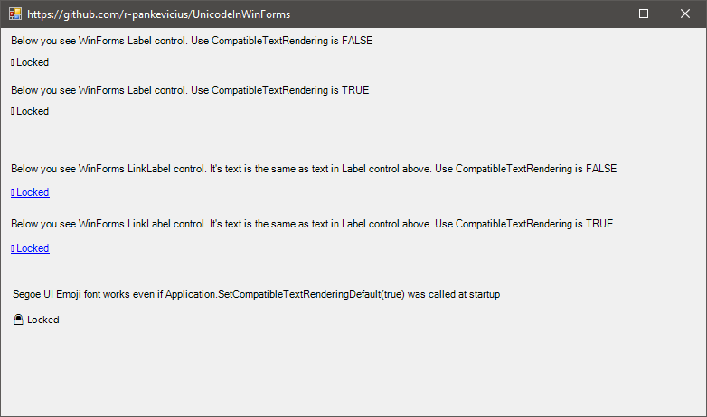

# Unicode In WinForms

Use [CompatibleTextRendering](https://docs.microsoft.com/en-us/dotnet/api/system.windows.forms.label.usecompatibletextrendering?view=netframework-4.8)=false
to avoid issues displaying Unicode characters, see image below.


## But that's too easy if you control the launcher app

Change Main() method in Program.cs to this and you'll run into "Ancient launcher" situation (like [here](https://stackoverflow.com/a/25387037/1175698)):

```csharp
/// <summary>
/// The main entry point for the application.
/// </summary>
[STAThread]
static void Main()
{
	Application.EnableVisualStyles();

	// This is what WinForms app wizard creates today
	//Application.SetCompatibleTextRenderingDefault(false);

	// This is what you may expect if running in "old container"
	Application.SetCompatibleTextRenderingDefault(true);

	Application.Run(new Form1());
}
```
.. and Unicode chars in all labels are not displayed anymore.

If the container has called `SetCompatibleTextRenderingDefault` you can't change it to another value.
Trying to execute `Application.SetCompatibleTextRenderingDefault(false)` later will give you an exeption:
```
System.InvalidOperationException:
SetCompatibleTextRenderingDefault must be called before the first IWin32Window object is created in the application.
```

How to solve this problem?


## The solution
The [Segoe UI Emoji font](https://docs.microsoft.com/en-us/typography/font-list/segoe-ui-emoji) was the solution.
The dialog now looks like this:

If container has called Application.SetCompatibleTextRenderingDefault(true) then only the last label using Segoe UI Emoji font is displayed OK.

If you need to create font for dynamically added controls:
```csharp
static readonly Font FontForLabelWithUnicodeChars = new Font("Segoe UI Emoji", 8.25f);
```

If "Segoe UI Emoji" is not found in the system, you'll get the fallback font "Microsoft Sans Serif".

If in legacy forms app you want just to change font for only these labels that contains unicode chars,
you can check it with code:
```csharp
bool hasUnicodez = label.Text.Any(ch => char.GetUnicodeCategory(ch) == System.Globalization.UnicodeCategory.Surrogate);`
````
