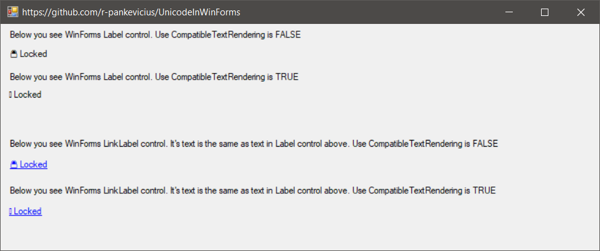

# Unicode In WinForms

Use [CompatibleTextRendering](https://docs.microsoft.com/en-us/dotnet/api/system.windows.forms.label.usecompatibletextrendering?view=netframework-4.8)=false
to avoid issues displaying Unicode characters, see image below.

